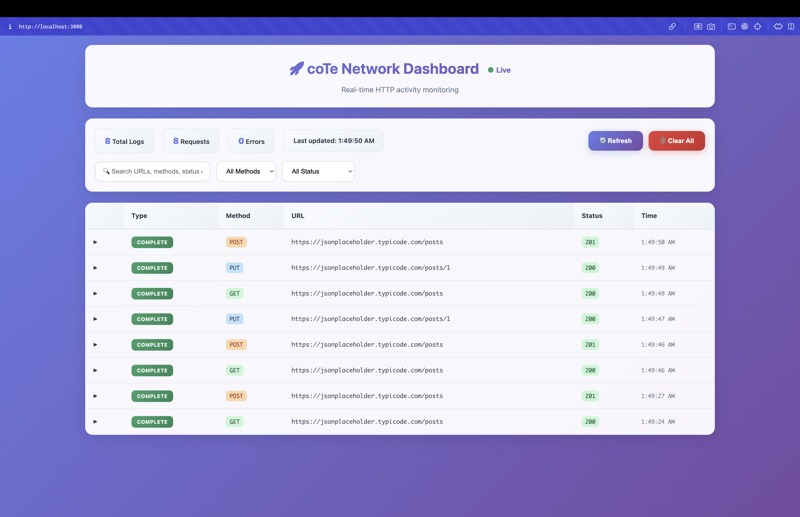

# 🚀 CoteNetworkLogger

A powerful Flutter package for real-time HTTP network monitoring during development.

## 🛠️ Quick Start (Dio)

1. **Add to your pubspec.yaml:**
   ```yaml
   dependencies:
     cote_network_logger: ^1.0.5
   ```

2. **Start the server in your main.dart:**
   ```dart
   import 'package:cote_network_logger/cote_network_logger.dart';

   void main() async {
     WidgetsFlutterBinding.ensureInitialized();
     await startNetworkLogServer();
     runApp(MyApp());
   }
   ```

3. **Add the interceptor to your Dio instance:**
   ```dart
   import 'package:dio/dio.dart';
   import 'package:cote_network_logger/cote_network_logger.dart';

   final dio = Dio();
   dio.interceptors.add(const CoteNetworkLogger());
   ```

4. **Open [http://localhost:3000](http://localhost:3000) in your browser to see the dashboard!**

## 🧪 **Quick Test (iPhone Simulator)**

To verify everything works on iPhone simulator:

1. **Run your Flutter app on iPhone simulator:**
   ```bash
   flutter run -d iPhone
   ```

2. **Open the dashboard in your Mac browser:**
   ```
   http://localhost:3000
   ```

3. **Verify the dashboard is working:**
   - ✅ You should see "🚀 coTe Network Dashboard" 
   - ✅ Connection status should show "Live" (green) or "Offline" (red)
   - ✅ Console should show: `🎯 Dashboard DOM loaded, initializing...`

4. **Test HTTP requests in your app:**
   - Tap buttons in your Flutter app to make HTTP requests
   - Watch requests appear in real-time on the dashboard
   - Try expanding rows to see request/response details

5. **If dashboard shows "Waiting for network requests":**
   - ✅ Dashboard is working correctly
   - ✅ Make HTTP requests in your app to see them appear

**Common Issues:**
- If browser shows "connection refused": Server might not be running
- If dashboard is blank: Check browser console for JavaScript errors
- If requests don't appear: Check that your Dio client has the interceptor added

---

## ✨ Features

- 🔍 **Real-time network monitoring** - See HTTP requests as they happen
- 📱 **Cross-platform support** - Android, iOS, macOS, Windows, Linux
- 🌐 **Web dashboard** - Beautiful browser-based interface
- 🎨 **Material Design 3** - Modern, responsive UI
- 📊 **Advanced filtering** - Search, filter by method, status codes
- 🔄 **Auto-refresh** - Smart refresh that pauses during user interaction
- 💾 **Memory efficient** - In-memory storage with auto-cleanup
- 🎯 **Development-only** - Automatically disabled in release mode

---

## 🧑‍💻 Advanced Usage

### Manual Logging
```dart
final logger = CoteNetworkLogger();

// Log a request
logger.logRequest(
  id: 'unique_request_id',
  url: 'https://api.example.com/data',
  method: 'GET',
  headers: {'Authorization': 'Bearer token'},
  requestBody: null,
);

// Log the response
logger.logResponse(
  id: 'unique_request_id',
  url: 'https://api.example.com/data',
  method: 'GET',
  statusCode: 200,
  headers: {'content-type': 'application/json'},
  responseBody: {'data': 'response'},
);
```

### HTTP Package Interceptor
```dart
import 'package:http/http.dart' as http;
import 'package:cote_network_logger/cote_network_logger.dart';

class NetworkLoggerInterceptor extends http.BaseClient {
  final http.Client _inner;
  final CoteNetworkLogger _logger;

  NetworkLoggerInterceptor(this._inner, this._logger);

  @override
  Future<http.StreamedResponse> send(http.BaseRequest request) async {
    final id = DateTime.now().millisecondsSinceEpoch.toString();
    
    // Log request
    _logger.logRequest(
      id: id,
      url: request.url.toString(),
      method: request.method,
      headers: request.headers,
      requestBody: request is http.Request ? request.body : null,
    );

    try {
      final response = await _inner.send(request);
      
      // Log response
      final responseBody = await response.stream.bytesToString();
      _logger.logResponse(
        id: id,
        url: request.url.toString(),
        method: request.method,
        statusCode: response.statusCode,
        headers: response.headers,
        responseBody: responseBody,
      );

      // Return new streamed response with the body
      return http.StreamedResponse(
        Stream.value(responseBody.codeUnits),
        response.statusCode,
        headers: response.headers,
        reasonPhrase: response.reasonPhrase,
      );
    } catch (e, stackTrace) {
      // Log error
      _logger.logError(
        id: id,
        url: request.url.toString(),
        method: request.method,
        error: e.toString(),
        stackTrace: stackTrace.toString(),
      );
      rethrow;
    }
  }
}

// Usage example:
final logger = CoteNetworkLogger();
final client = NetworkLoggerInterceptor(http.Client(), logger);

// Use the client for HTTP requests
final response = await client.get(Uri.parse('https://api.example.com/data'));
```

---

## Example Usage

```dart
class ApiService {
  final Dio _dio = Dio();

  ApiService() {
    // Add the network logger
    _dio.interceptors.add(const CoteNetworkLogger());
  }

  Future<Response> getPosts() {
    return _dio.get('https://jsonplaceholder.typicode.com/posts');
  }

  Future<Response> createPost(Map<String, dynamic> data) {
    return _dio.post('https://jsonplaceholder.typicode.com/posts', data: data);
  }
}
```

---

## 🌐 Accessing the Dashboard

The dashboard access method depends on your development setup:

### 📱 **iOS Simulator** (Best for Mac)
1. Run your Flutter app on iOS simulator
2. **Open browser on your Mac** (host machine)  
3. Navigate to: **http://localhost:3000**

### 📱 **Android Emulator** (Limited Access)
1. Run your Flutter app on Android emulator
2. **Open browser on the Android emulator itself**
3. Navigate to: **http://localhost:3000**
4. Make HTTP requests in your app to see them appear!

**Note**: Due to emulator network isolation, you cannot access the dashboard from your Mac/Windows browser. Use a physical Android device if you want to view the dashboard on your computer.

### 📱 **Physical Android Device**
1. Find your device's IP address:
   - Go to **Settings > About > Status > IP Address**
   - Example: `192.168.1.100`
2. **Open browser on any device on the same network**
3. Navigate to: **http://YOUR_DEVICE_IP:3000**
   - Example: `http://192.168.1.100:3000`

### 📱 **Physical iOS Device**
1. Find your device's IP address:
   - Go to **Settings > Wi-Fi > Your Network > IP Address**
   - Example: `192.168.1.101`
2. **Open browser on any device on the same network**
3. Navigate to: **http://YOUR_DEVICE_IP:3000**
   - Example: `http://192.168.1.101:3000`

#### 🔧 **iOS Local Network Setup** (Required for Physical iOS Devices)

When running on a physical iPhone/iPad, you **must** enable Local Network permissions:

1. **Go to iOS Settings**:
   ```
   Settings > Privacy & Security > Local Network
   ```

2. **Find your app** in the list and **toggle it ON**

3. **Alternative method** if app doesn't appear:
   - Run your Flutter app once
   - Try to access the dashboard from your Mac browser
   - iOS will show a popup asking for Local Network permission
   - Tap **"Allow"**

4. **Verify permissions**:
   - Look for console message: `✅ Your device IP: xxx.xxx.xxx.xxx`
   - If you see IP address, permissions are working correctly

#### 📋 **iOS Troubleshooting Checklist**

❌ **Dashboard not accessible from Mac browser?**
- [ ] Local Network permission enabled for your app?
- [ ] Both iPhone and Mac on same Wi-Fi network?
- [ ] Using correct IP address (not `localhost`)?
- [ ] Server started successfully? (check debug console)

✅ **Working setup should show**:
```
flutter: 🚀 NetworkLogWebServer: Starting server on 0.0.0.0:3000...
flutter: ✅ NetworkLogWebServer: Server started successfully!
flutter: 🌐 Network Logger Dashboard: http://localhost:3000 (simulator) or http://YOUR_MAC_IP:3000 (physical device)
flutter: 📱 Physical iPhone: Open http://192.168.1.101:3000 in Safari
flutter:    ✅ Your device IP: 192.168.1.101
```

### 💻 **Desktop (macOS/Windows/Linux)**
1. Run your Flutter app
2. Open browser on the same machine
3. Navigate to: **http://localhost:3000**

## 🎯 Dashboard Features

### Real-time Monitoring
- ⚡ **Auto-refresh** every 3 seconds
- 🤚 **Smart pause** during user interaction (15 seconds)
- 📊 **Live statistics** (total requests, errors, last updated)

### Advanced Filtering
- 🔍 **Search** by URL, method, status code
- 🏷️ **Filter by HTTP method** (GET, POST, PUT, DELETE, PATCH)
- 📈 **Filter by status code** (2xx Success, 4xx Client Error, 5xx Server Error)

### Beautiful Interface
- 🎨 **Material Design 3** with gradients and animations
- 📱 **Responsive design** for all screen sizes
- 🌈 **Syntax-highlighted JSON** with collapsible sections
- 📋 **Copy JSON** functionality with visual feedback
- 🔄 **Perfect scrolling** with position preservation

## 🧪 Testing the Setup

Run the test example to verify everything works:

```bash
flutter run example/test_dashboard.dart
```

This will:
1. Start the dashboard server
2. Show you the correct URL for your platform
3. Provide test buttons to make HTTP requests
4. Verify the dashboard receives and displays the requests

## 🔧 Troubleshooting

### Dashboard Not Loading

#### Android Emulator Issue
**Problem**: "Can't access http://localhost:3000 from Mac browser"

**Solution**: Android emulator network is isolated from the host machine:
- ✅ **Correct**: Open browser **on the Android emulator** and go to `http://localhost:3000`
- ❌ **Incorrect**: Trying to access from your Mac/Windows browser (this won't work)
- 💡 **Better option**: Use iOS Simulator or a physical Android device for better dashboard access

#### Network Connectivity
**Problem**: "Connection refused" or "Can't connect"

**Solutions**:
1. **Check server is running**: Look for console message `✅ NetworkLogWebServer: Server started successfully!`
2. **Verify platform support**: Only works on Android, iOS, macOS, Windows, Linux (not web browsers)
3. **Check debug mode**: Only works in debug mode, not release builds
4. **Firewall**: Ensure port 3000 is not blocked

#### Physical Device Issues
**Problem**: "Can't access dashboard from other devices"

**Solutions**:
1. **Same network**: Ensure both devices are on the same Wi-Fi network
2. **Correct IP**: Use the device's IP address, not `localhost`
3. **Firewall**: Check device firewall settings allow incoming connections

### Performance Issues

#### Memory Usage
- Dashboard automatically keeps only the last 200 logs
- Old logs are automatically cleaned up
- No persistent storage - everything is in memory

#### Auto-refresh Interruption
- Dashboard pauses auto-refresh during user interaction
- Scrolling in JSON containers pauses for 15 seconds
- Main scrolling pauses for 10 seconds
- Manual refresh button always available

## 📚 API Reference

### CoteNetworkLogger

#### Methods

```dart
// Start the dashboard server
Future<bool> startDashboard()

// Log an HTTP request
void logRequest({
  required String id,
  required String url,
  required String method,
  Map<String, dynamic>? headers,
  dynamic requestBody,
})

// Log an HTTP response
void logResponse({
  required String id,
  required String url,
  required String method,
  required int statusCode,
  Map<String, dynamic>? headers,
  dynamic responseBody,
})

// Log an HTTP error
void logError({
  required String id,
  required String url,
  required String method,
  required String error,
  String? stackTrace,
})

// Check if web server is supported
bool get isWebServerSupported

// Get dashboard URL
String get dashboardUrl

// Check if dashboard is running
bool get isDashboardRunning
```

## 🎨 Dashboard Screenshots

### Main Interface


### Request Details


### Filtering


### Side by Side


## 🤝 Contributing

Contributions are welcome! Please feel free to submit a Pull Request.

## 📄 License

This project is licensed under the MIT License - see the [LICENSE](LICENSE) file for details.

## 🚀 Get Started

Ready to monitor your HTTP requests? Install the package and start logging!

```bash
flutter pub add cote_network_logger
```

Happy debugging! 🐛✨

## 🖥️ Platform Compatibility & Access Table

### How to Access the Dashboard on Different Platforms

| Platform                | Where to Run App         | How to Access Dashboard                | Supported? | Notes |
|-------------------------|--------------------------|----------------------------------------|------------|-------|
| **iOS Simulator (Mac)** | iOS Simulator            | Mac browser: `http://localhost:3000`   | ✅         | Seamless, shares Mac network |
| **Android Emulator**    | Android Emulator         | Emulator browser: `localhost:3000`     | ✅         | Only accessible from emulator browser |
| **Android Emulator**    | Android Emulator         | Mac/Windows browser: `localhost:3000`  | ❌         | Not possible due to network isolation |
| **Physical Android**    | Android Device           | Mac/Windows browser: `http://DEVICE_IP:3000` | ✅   | Both devices must be on same WiFi |
| **Physical iOS**        | iPhone/iPad              | Mac browser: `http://DEVICE_IP:3000`   | ✅         | Both devices must be on same WiFi |
| **Desktop (Mac/Win)**   | Mac/Windows/Linux        | Local browser: `http://localhost:3000` | ✅         | Easiest for desktop apps |

### 🚩 **Important Notes**
- `localhost` in your Mac/Windows browser is **not** the same as `localhost` in the Android emulator.
- The iOS Simulator shares the host network, so `localhost:3000` works from your Mac browser.
- The Android Emulator is isolated; you **cannot** access its server from your Mac/Windows browser at `localhost:3000`.
- For Android Emulator, use the emulator's browser to view the dashboard, or use a physical device for cross-device access.
- For physical devices, use the device's IP address in your browser.

### 🛠️ **Troubleshooting**
- If you see `ERR_CONNECTION_REFUSED` in your Mac/Windows browser when using the Android emulator, this is expected due to emulator network isolation.
- For seamless dashboard access on your computer, use iOS Simulator or a physical device.
- For Android development, prefer a physical device if you want to view the dashboard on your computer.

### 📚 **References**
- [Android Emulator Networking (Official Docs)](https://developer.android.com/studio/run/emulator-networking)
- [Apple iOS Simulator Networking](https://developer.apple.com/documentation/xcode/running-your-app-in-simulator-or-on-a-device#Networking)